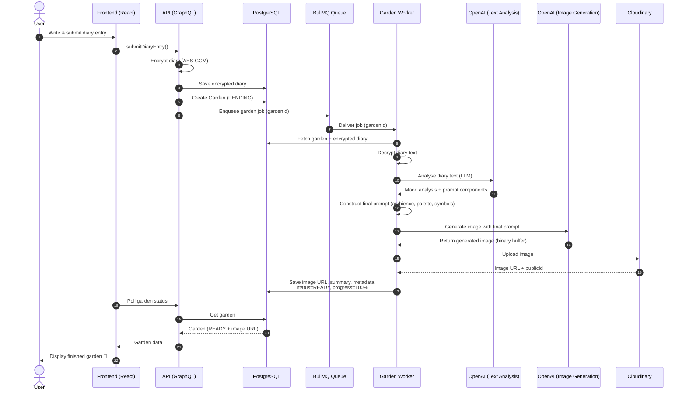

#  **Mood Gardens**
### *An AI-generated visual diary with encryption, aggregation, and emotional landscape generation*

Mood Gardens transforms personal diary entries into **AI-generated emotional gardens**.  
It combines **React + TypeScript**, **Node/Express + GraphQL**, **Prisma + Postgres**, **Redis + BullMQ workers**, **AES-GCM encryption**, and **OpenAI image generation**.

This repository is designed as a **portfolio flagship project**, showcasing full-stack engineering, distributed systems, security, and cloud DevOps.

---

##  Features

###  AI Mood Analysis
- Semantic mood extraction from diary entries  
- Weighted emotion scoring  
- Dynamic prompt generation for OpenAI image models  

###  Generative Mood Gardens
- AI-generated images based on emotional signatures  
- Custom ambience layers, palettes, and generative rules  
- Daily / weekly / monthly / yearly gardens  

###  Zero-Trust Encryption Model
- AES-GCM encryption for all diary entries  
- Per-user Data Encryption Keys (DEKs)  
- Keys encrypted via Azure Key Vault  
- No plaintext diary content stored anywhere  

###  Time-Period Aggregation Engine
- Daily → Weekly → Monthly → Yearly summaries  
- BullMQ workers for background processing  
- Retries, idempotency, and progress reporting  
- Timezone-aware with custom “day rollover” per user  

###  Elegant Frontend
- React + Vite + TypeScript + Tailwind CSS  
- Apollo Client for GraphQL  
- Live job progress for garden generation  
- Secure login & Google OAuth  
- Mobile-friendly UI  
- Hosted on Vercel (mymoodgardens.com)

### Strong Backend
- Node.js + Express + Apollo GraphQL  
- Prisma ORM  
- PostgreSQL (Azure)  
- Redis queue engine  
- Cloudinary for image uploads  
- Hosted on Azure Container Apps

---

## Architecture Overview

User writes diary entry  
| 
v 
Diary entry encrypted (AES-GCM) 
| 
v 
Saved to DB (encrypted) ----> Garden record created (PENDING) 
| 
v 
Garden job queued (BullMQ) 
| 
v 
    
Garden Worker processes job: 
1. Fetch garden + decrypt diary 
2. Analyse emotions + generate prompt 
3. Request image from OpenAI 
4. Upload image to Cloudinary 
5. Save final summary + metadata
    
| 
v 
Garden marked READY → User sees result

## MoodGardens – Image Generation Pipeline (Overview)

The MoodGardens Image Generation Pipeline transforms encrypted diary entries into AI-generated emotional gardens using a secure, multi-stage processing workflow.
The system is designed for privacy, scalability, and asynchronous processing, powered by BullMQ, Redis, Prisma, OpenAI, and Cloudinary

### High Level Architecture

---

## Security Highlights

- AES-GCM encryption (256-bit)  
- Unique encrypted DEK per user  
- Diary text *never* exists unencrypted in the DB  
- Secure cookies (`SameSite=None`, `Secure`, domain-scoped)  
- Sanitized public share pages  
- Strict GraphQL validation  

---

##  Deployment & DevOps

- Docker multi-stage builds  
- GitHub Actions CI/CD  
- Push → Build → Push to Docker Hub → Deploy to Azure  
- Independent scaling for API vs workers  
- Vercel hosting for the frontend  
- Environment secrets stored in Azure Key Vault + Vercel  

---

## 📂 Tech Stack

**Frontend:**  
React, Vite, TypeScript, Tailwind, Apollo Client  

**Backend:**  
Node.js, Express, GraphQL, Prisma, PostgreSQL  

**AI:**  
OpenAI API (image + text), custom prompt engine  

**Workers:**  
Redis, BullMQ, multi-container worker system  

**Cloud:**  
Azure Container Apps, Azure Redis, Azure Postgres, Azure Key Vault  

**Storage:**  
Cloudinary (image hosting), PostgreSQL (structured data)  

**DevOps:**  
Docker, Docker Hub, GitHub Actions  

---

## 🎨 Example Output

---

## 👤 About the Developer

Hi — I’m **Alex Crabbe**, a full-stack developer with a background in **Biomedical Physics (MRI simulations)**.

Mood Gardens demonstrates:

- End-to-end encryption  
- Distributed background processing  
- AI image generation pipelines  
- Cloud-native deployment  
- Complex frontend + backend integration  
- Secure authentication and cookie flows  

**Portfolio:** https://www.alex-crabbe.vercel.app  
**Project:** https://www.mymoodgardens.com  

---

## 📩 Contact

**Portfolio:** https://alex-crabbe.vercel.app/contact

